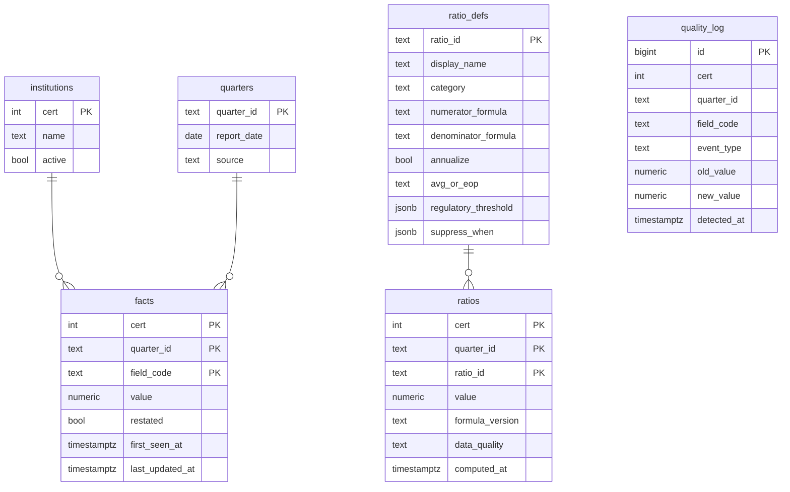

# Architecture

Peerbench is a quarterly bank peer-benchmarking tool. It pulls FDIC Call Report data for a 5-bank slice (MidFirst Bank + 4 peers), computes 30 banking ratios, and serves them through a Next.js dashboard and an Excel comp workbook download.

## System diagram

```mermaid
flowchart LR
  subgraph sources[External sources]
    FDIC[FDIC BankFind API]
    CDR[FFIEC CDR<br/>bulk download]
  end

  subgraph pipeline[Python pipeline · uv]
    Ingest[ingest<br/>idempotent upsert]
    Detect[restatement<br/>detector]
    Compute[ratio_engine<br/>30 handlers]
    Export[Excel workbook<br/>generator]
  end

  subgraph supabase[Supabase project]
    Facts[(facts)]
    Ratios[(ratios)]
    QLog[(quality_log)]
    Defs[(ratio_defs)]
    Inst[(institutions)]
    Q[(quarters)]
    Bucket[(Storage:<br/>peerbench-exports)]
  end

  subgraph cron[GitHub Actions]
    Daily[daily-ingest.yml<br/>03:00 UTC]
    Weekly[weekly-backup.yml]
  end

  subgraph web[Vercel · Next.js 16]
    SSR[Server Components<br/>matrix + drilldown]
    Manifest[latest.json<br/>workbook freshness]
  end

  FDIC -->|httpx| Ingest
  CDR -.->|manual ZIP refresh<br/>2 of 30 ratios| Ingest
  Daily --> Ingest
  Ingest -->|upsert PK<br/>cert+quarter+field| Facts
  Ingest --> Detect
  Detect -->|on diff: flip restated| Facts
  Detect -->|writes events| QLog
  Compute -->|reads facts<br/>per ratio handler| Facts
  Compute -->|reads schema| Defs
  Compute --> Ratios
  Export -->|reads ratios table only| Ratios
  Export -->|HTTP PUT| Bucket
  Daily --> Export
  Weekly -->|pg_dump| Bucket
  Inst --> Facts
  Q --> Facts
  SSR -->|@supabase/ssr<br/>anon key| Ratios
  SSR --> Defs
  SSR --> Inst
  SSR --> QLog
  SSR -->|<Suspense> fetch| Manifest
  Manifest --> Bucket
  Bucket -->|download link| User([Visitor])
  SSR --> User
```

## Components

### Python pipeline (`src/peerbench/`)

Single-package monolith. Python 3.13, `uv` for dependency management, `ruff` for format, `pyright --strict` for types, `pytest` for tests.

| Module | Responsibility |
| :--- | :--- |
| `cli.py` | `typer` entrypoint. Sub-commands: `ingest`, `compute`, `export`, `validate`, `seed-ratios`, `upload-workbook`. |
| `ingest/` | FDIC BankFind API client (`httpx` + `tenacity` retries), FFIEC CDR ZIP parser, upsert layer. |
| `ratio_engine/` | Handler registry, dependency map, `FactView` interface. One handler per ratio. |
| `ratio_engine/handlers/` | The 30 ratio handlers, grouped by category (`profitability.py`, `yields.py`, etc.). |
| `export/` | `openpyxl` workbook generator. Reads from `ratios` table; never recomputes. |
| `storage/` | Supabase Storage upload client. Plain `httpx`, no SDK dependency. |
| `validate/` | Cross-checks computed ratios against FDIC pre-computed values (Phase 1 DoD). |
| `db/` | `sqlalchemy` 2.0 engine, `pg8000` driver, session management. |

### Next.js dashboard (`web/`)

Next.js 16 with App Router. Server Components by default, no `any`, strict TypeScript. Hosted on Vercel Hobby with Root Directory = `web/`.

| Module | Responsibility |
| :--- | :--- |
| `app/page.tsx` | Server-rendered matrix view. One server component, no client-side data fetching. |
| `app/ratio/[ratio_id]/page.tsx` | Per-ratio drilldown — 8-quarter trend + peer distribution strip plot. `notFound()` on unknown ratios or ratios with no values. |
| `lib/queries.ts` | All Supabase reads. `getMatrixData()`, `getRatioTimeSeries()`. Anchors quarter discovery on `ratios` (not `quarters`) to avoid pointing at empty fresh quarters. |
| `lib/ratio-order.ts` | Display order for the matrix. Mirrors `data/ratios.csv` row order. |
| `lib/heatmap.ts`, `heatmap-directions.ts` | Conditional formatting — quartile-based color heat map with per-ratio higher-is-better/worse semantics. |
| `lib/ratio-series.ts`, `ratio-field-deps.generated.json` | Trend chart helpers + handler-field dependency map (generated from Python AST). |
| `components/ratio-matrix.tsx` | TanStack Table with sort, category collapse, restatement markers (`r` superscript), regulatory flags (`△` for CRE/CD breach). |
| `components/ratio-trend-chart.tsx`, `ratio-distribution.tsx` | Recharts wrappers — anchor drawn last so it sits on top of peer overlap. |

### Daily cron (`.github/workflows/daily-ingest.yml`)

Runs at 03:00 UTC. Sequential steps:

1. Checkout repo, install Python deps via `uv sync`.
2. `peerbench ingest` for each of the 5 banks × 8 quarters (idempotent upserts; restatement detector fires per-row).
3. `peerbench compute` for each bank (handler bodies write to `ratios`).
4. `peerbench export --quarter latest --output ./output` (generates the Excel workbook from `ratios` table).
5. `peerbench upload-workbook --file ./output/latest.xlsx` (PUTs both `latest.xlsx` and `latest.json` manifest to Supabase Storage).

Doubles as the **Supabase free-tier inactivity heartbeat** — without it firing daily the project pauses after 7 days. No separate heartbeat job.

## Data model

Six tables in `public` schema. RLS enabled on all of them; reads via the anon key, writes via the service-role key.



**Key constraints:**

- `facts (cert, quarter_id, field_code)` is the upsert key. Idempotent re-runs are safe.
- `ratios.data_quality` is one of `ok | partial | suppressed | mismatch`. Cells with `value IS NULL` and `data_quality = 'partial'` represent insufficient inputs (e.g. trailing ratios on the earliest quarters in the window).
- `ratio_defs.suppress_when` carries declarative suppression rules — e.g. `{"cblr": true}` hides Tier 1 RBC for community-bank-leverage-ratio filers, who don't compute it.
- `quality_log.event_type ∈ {missing, suppressed, restated, mismatch}` — every quality event is auditable, with old/new values and timestamps.

## Ratio handler/def contract

Each of the 30 ratios has two sources of truth that must stay in lock-step:

- **`ratio_defs` row** (seeded from `data/ratios.csv`) — the human-readable spec: display name, formula text, category, regulatory threshold, suppression rules.
- **`@ratio(...)` decorated handler** (`src/peerbench/ratio_engine/handlers/*.py`) — the executable Python.

A contract test (`tests/contract/test_ratio_registry.py`) walks the registry and asserts a 1:1 correspondence. Adding a ratio means editing `data/ratios.csv`, writing a handler, and running `uv run peerbench seed-ratios` — the contract test catches drift.

Example handler:

```python
@ratio("nim", version="v1")
def compute_nim(f: FactView) -> Decimal:
    # Net Interest Margin = NIM income / average earning assets (annualized).
    return f["NIM"] / f["ERNAST5"]
```

`FactView` is a typed accessor: `f["FIELD_CODE"]` returns a `Decimal` or raises `MissingFactError` (caught by the compute layer, which writes a `partial` row with `value=null`).

**No formula logic lives outside the pipeline.** The dashboard and Excel export both read from the `ratios` table — they never re-derive values. This keeps the formula surface single-rooted: change one Python handler, the matrix + drilldown + workbook all update together.

## Restatement detector

FDIC re-publishes Call Report data when banks file amendments. The detector runs on every ingest:

1. For each incoming `(cert, quarter_id, field_code)` row, look up the existing `facts.value`.
2. If the value differs from what's stored (within a numeric tolerance), flip `facts.restated = true` and `last_updated_at = now()`.
3. Write a `quality_log` row with `event_type='restated'`, plus the old and new values.
4. Mark all `ratios` rows that depend on this field for recomputation (via the handler dependency map exported to `web/lib/ratio-field-deps.generated.json`).

The dashboard surfaces restatements as `r` superscripts on affected cells, with a hover tooltip showing the field code, old and new values, and detection timestamp. The matrix → `quality_log` join happens server-side in `getMatrixData()`; the client never sees raw field codes.

## Excel workbook export

`peerbench export --quarter latest` generates a 15-sheet `openpyxl` workbook:

- **Cover** — title, anchor cert, quarter, methodology link.
- **Summary** — anchor vs peer-median snapshot for the latest quarter.
- **One comp sheet per peer bank** (4 sheets) — side-by-side anchor vs that peer across every ratio.
- **One time-series sheet per ratio category** (7 sheets: Profitability, Yields & costs, Balance sheet mix, Asset quality, Capital, Concentration, Liquidity & deposit composition). Each holds the trailing 8 quarters for that category's ratios.
- **Restatement Log** — `quality_log` dump for facts revised by FDIC affecting workbook ratios.
- **Methodology** — formula references, data sources, regulatory thresholds.

The workbook reads from the same `ratios` table the dashboard uses. The `--quarter latest` sentinel anchors on `MAX(ratios.quarter_id)` (not `quarters.quarter_id`), matching the dashboard's "latest with computed values" rule.

After generation, the daily cron uploads both the workbook and a JSON manifest to Supabase Storage:

```json
{
  "url": "https://<project>.supabase.co/storage/v1/object/public/peerbench-exports/latest.xlsx",
  "generated_at": "2026-05-25T07:18:31.108813+00:00",
  "quarter_id": "2025-Q4",
  "anchor_cert": 4063,
  "size_bytes": 61025
}
```

The dashboard reads the manifest via `<Suspense fallback={null}>` so the manifest fetch streams independently of the main matrix query. On 404, timeout, or parse failure, the download surface renders empty — graceful degradation when the cron hasn't published yet.

## Key design decisions

- **Single source of truth for ratios.** Formulas live in Python handlers; everything else (dashboard cells, Excel cells, drilldown charts) reads computed values from the `ratios` table. Documented in `CLAUDE.md` under "Don'ts".
- **Pipeline is idempotent.** Daily cron re-fetches the trailing 8 quarters every run. Upserts on `(cert, quarter_id, field_code)` mean re-runs are safe — and the restatement detector relies on this re-fetch to spot diffs.
- **Quarter discovery anchors on `ratios`, not `quarters`.** The FDIC API ingest can write a `quarters` row before compute populates `ratios` for it (e.g., 2026-Q1 exists with zero facts before banks file). Anchoring on `quarters.report_date` would surface an empty fresh quarter.
- **Design tokens, not hardcoded styles.** `docs/design.md` is the source of truth for colors, typography, layout rules. Encoded in Tailwind v4's `@theme` block in `web/app/globals.css`. Derived tokens that compose other tokens via `color-mix()` live in `:root` (Tailwind v4 can't resolve nested `var()` chains at theme-parse time).
- **Post-CECL nomenclature.** Allowance for Credit Losses (ACL), not Allowance for Loan and Lease Losses (ALLL). The CSV and handler names reflect this.
- **No M&A, capital plans, deposit beta models, or pricing models.** Scope is intentionally narrow — peer benchmarking only.

## Folder layout

```
.
├── ARCHITECTURE.md             (this file)
├── CLAUDE.md                   (Claude Code project conventions)
├── PLAN.md                     (originating project plan, v1.3)
├── README.md                   (install + run)
├── data/
│   └── ratios.csv              (canonical ratio spec — seeds `ratio_defs`)
├── docs/
│   ├── design.md               (design tokens + layout rules)
│   ├── operations.md           (runbooks: ingest, backup, restore, RLS)
│   ├── cdr-ingest.md           (manual FFIEC CDR refresh procedure)
│   ├── divergences.md          (Phase 1 validation notes vs FDIC pre-computed)
│   ├── validation-snapshot.md  (DoD evidence)
│   └── screenshots/            (matrix + drilldown PNG/PDF for README + print)
├── sql/
│   ├── schema.sql              (canonical schema; mirrors live DB)
│   └── migrations/             (numbered, idempotent)
├── src/peerbench/              (Python pipeline package)
├── tests/                      (pytest)
├── web/                        (Next.js 16 dashboard — own package, own tsconfig)
└── .github/workflows/          (daily-ingest + weekly-backup)
```

## Local development

See [`README.md`](./README.md) for install and run. Operational runbooks (cron failure triage, backup restore, RLS rollback) live in [`docs/operations.md`](./docs/operations.md).
