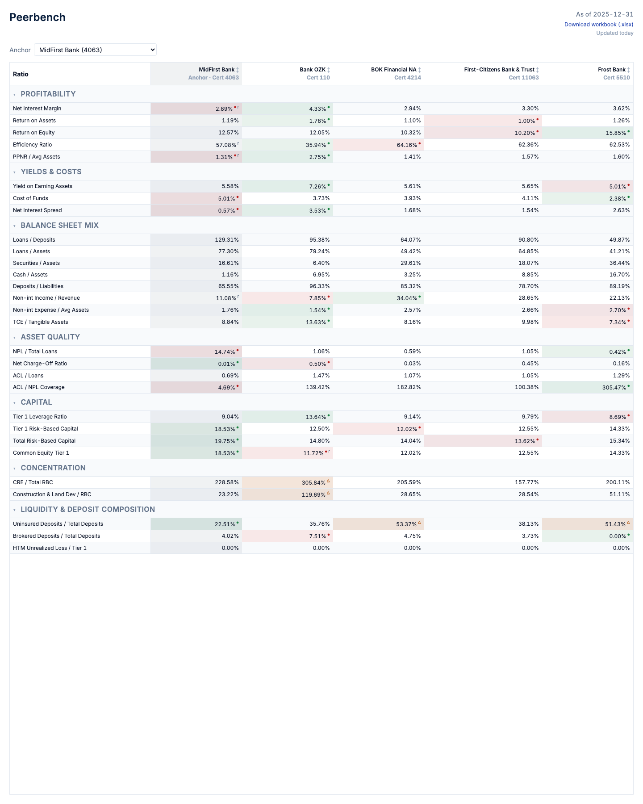
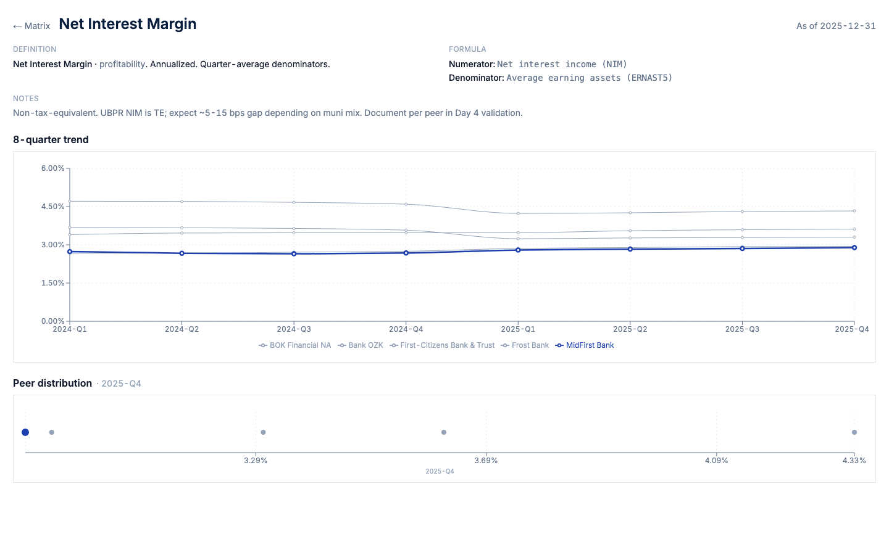

# Peerbench

Computes 30 quarterly banking ratios for a 5-bank slice from FDIC Call Report data, renders them in a Next.js dashboard with conditional formatting and per-ratio drilldowns, and ships a 15-sheet Excel comp workbook.

[](https://github.com/ConnorTipton/Peerbench/actions/workflows/daily-ingest.yml)
[](https://github.com/ConnorTipton/Peerbench/actions/workflows/weekly-backup.yml)

**Live demo:** https://peerbench-web.vercel.app



## What it does

- Pulls FDIC BankFind API data nightly for an anchor bank and its peer set.
- Computes 30 banking ratios across 7 categories (profitability, yields, balance sheet, asset quality, capital, concentration, liquidity) via a Python pipeline. Every ratio has a declarative spec, an executable handler, and a contract test that keeps them in lock-step.
- Detects restatements automatically — when FDIC re-publishes a quarter, affected cells get an `r` superscript with hover detail showing the old and new values.
- Renders the matrix with quartile-based conditional formatting and per-ratio drilldowns showing 8-quarter trends and peer distribution strip plots.
- Generates a 15-sheet Excel workbook nightly and serves it via the dashboard.

## Quick start

### Try it live

Open [peerbench-web.vercel.app](https://peerbench-web.vercel.app). Click any ratio name to open its drilldown; click *Download workbook (.xlsx)* in the top right to pull the latest Excel comp.

### Run the dashboard locally

```bash
cd web
cp .env.local.example .env.local   # fill in NEXT_PUBLIC_SUPABASE_URL + NEXT_PUBLIC_SUPABASE_ANON_KEY
npm install
npm run dev                         # http://localhost:3000
```

### Run the pipeline locally

Requires Python 3.13 and [`uv`](https://docs.astral.sh/uv/).

```bash
uv sync
cp .env.example .env                # fill in FDIC_API_KEY + SUPABASE_URL + SUPABASE_SERVICE_ROLE_KEY + DATABASE_URL
uv run peerbench seed-ratios        # one-time: load ratio_defs from data/ratios.csv
uv run peerbench ingest --cert 4063 --quarters 8
uv run peerbench compute --cert 4063 --quarters 8
uv run peerbench export --quarter latest --output ./output
```

`uv run peerbench --help` lists every sub-command.

## Screenshots

| Matrix view | Per-ratio drilldown |
| :---: | :---: |
|  |  |

Print PDFs (letter format, generated client-side from the same SSR pages) at [`docs/screenshots/print-summary.pdf`](docs/screenshots/print-summary.pdf) and [`docs/screenshots/print-ratio-nim.pdf`](docs/screenshots/print-ratio-nim.pdf).

## Tech stack

- **Python 3.13** pipeline: `httpx`, `polars`, `openpyxl`, `sqlalchemy` + `pg8000`, `typer`, `pydantic-settings`. Managed with `uv`, formatted with `ruff`, type-checked with `pyright --strict`, tested with `pytest`.
- **Next.js 16** dashboard (App Router, Server Components, strict TypeScript): `@supabase/ssr`, `@tanstack/react-table`, `recharts`. Tested with `vitest`.
- **Supabase Postgres** (storage + RLS) and **Supabase Storage** (workbook bucket).
- **Vercel Hobby** for hosting.
- **GitHub Actions** for the daily ingest + compute + export + upload cron, plus a weekly `pg_dump` backup.

## Project structure

```
.
├── src/peerbench/        Python pipeline (ingest, compute, export, validate)
├── web/                  Next.js dashboard
├── data/ratios.csv       Canonical ratio specs (seeds ratio_defs)
├── sql/                  Schema + numbered migrations
├── docs/                 Design tokens, runbooks, screenshots
└── .github/workflows/    daily-ingest, weekly-backup
```

## Documentation

- [`ARCHITECTURE.md`](./ARCHITECTURE.md) — system diagram, data model, ratio handler/def contract, restatement detector flow, key design decisions.
- [`docs/operations.md`](./docs/operations.md) — runbooks for cron failure triage, backup restore, RLS rollback.
- [`docs/design.md`](./docs/design.md) — design tokens, layout rules, banking-grade typography decisions.
- [`PLAN.md`](./PLAN.md) — originating project plan (v1.3).
- [`CLAUDE.md`](./CLAUDE.md) — repo conventions (Python style, TypeScript style, DB naming, "no formula logic in the dashboard layer", sub-agent + slash command list).

## Status

Phase 1 (pipeline) + Phase 2 (dashboard) + Phase 3 (hosting) + Phase 4.2 (workbook download) + Phase 4.3 (banking design pass + print CSS) are **DoD-complete**. Daily ingest cron green ≥3 consecutive days; weekly backup green; full vitest + pytest suite passing.

## License

MIT.
